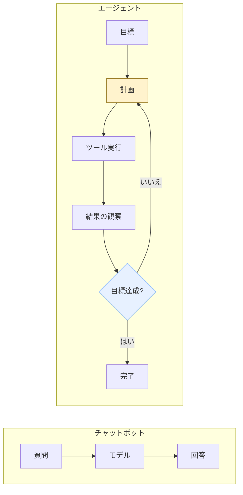
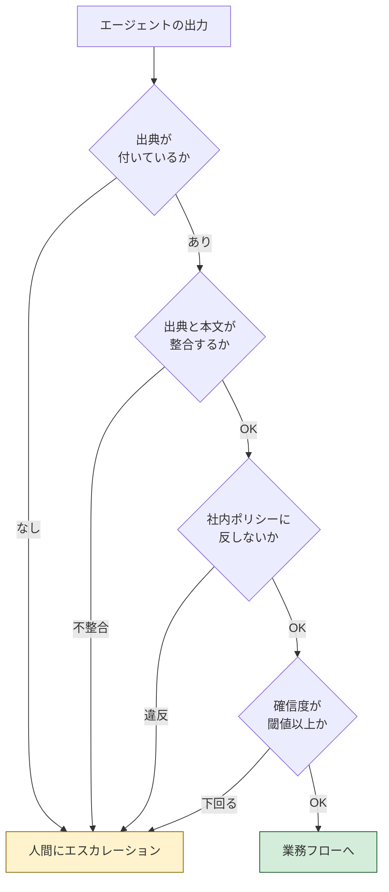
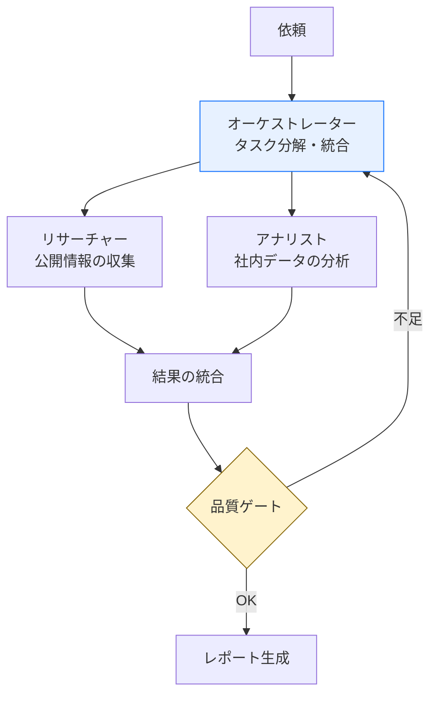

AIエージェントを業務に入れる話が、2026年に入って一気に具体的になった。同時に、うまくいかない話も増えた。

Gartnerは2025年8月に、[2026年までに企業アプリケーションの40%がタスク特化型AIエージェントを搭載する](https://www.gartner.com/en/newsroom/press-releases/2025-08-26-gartner-predicts-40-percent-of-enterprise-apps-will-feature-task-specific-ai-agents-by-2026)と予測した。2025年時点では5%未満だったので、大きな伸びになる。

ただ、同じGartnerが2025年6月には[エージェンティックAIプロジェクトの40%以上が2027年末までに中止される](https://www.gartner.com/en/newsroom/press-releases/2025-06-25-gartner-predicts-over-40-percent-of-agentic-ai-projects-will-be-canceled-by-end-of-2027)とも予測している。理由として挙がっているのは、コストの膨張・ビジネス価値の不明確さ・リスク統制の不足の3つ。

この2つを並べて読むと、方向性ははっきりしている。エージェントは入る。そして半分近くは途中で止まる。止まる理由は技術ではなく、権限・品質・コストの3点だ。

この記事では、その3点をどう先に決めておくかを書く。

## チャットボットとエージェントの違いは「ループがあるか」

まず用語の整理から。従来のチャットボットは1ターンで完結する。質問が来て、答えを返して、終わり。

エージェントは「観察→計画→実行→再観察」のループを回す。実行してみて、結果が足りなければもう一度計画に戻る。



| 比較軸 | チャットボット | エージェント |
|---|---|---|
| 処理 | 単発の質問応答 | 目標に向けた多ステップ処理 |
| 外部連携 | 決め打ちのAPI呼び出し | ツールを状況に応じて選んで実行 |
| 文脈 | セッション内 | タスク状態を保持して跨ぐ |
| 失敗時 | エラーを返す | 別の手段を試す |
| コスト | 1リクエスト1回の推論 | **1リクエストで数回〜数十回の推論** |

最後の行が、後でコストの話につながる。ループがあるということは、1件の依頼あたりのLLM呼び出し回数が事前に決まらないということでもある。

## MCPで「つなぐ」部分は実際に楽になった

2025年から2026年にかけて、エージェントと外部システムを繋ぐ部分は標準化が進んだ。MCP（Model Context Protocol）だ。

Anthropicが策定したこのプロトコルは、2025年12月にLinux Foundation傘下のAgentic AI Foundationへ寄贈されている。OpenAIとBlockが共同創設メンバー、AWS・Google・Microsoft・Cloudflare・GitHub・Bloombergがサポートメンバーとして参加している。特定ベンダーの仕様ではなくなった、と言っていい。

サーバーの数も増えた。公式レジストリのAPIで数えると2026年5月時点で約9,600件、バージョン込みでは約29,000件。寄贈時点でAnthropicは公開MCPサーバーが1万を超えたと発表している。

日本のSaaSも対応が進んでいる。裏が取れたものだけ挙げる。

- **freee**：2026年3月2日に[freee-mcpをOSS公開](https://gihyo.jp/article/2026/03/freee-mcp)。その後リモート版も提供
- **マネーフォワード**：2026年3月26日、クラウド会計の公式リモートMCPサーバーを全プランで提供開始
- **kintone**：2026年6月15日に[Documentation MCPサーバーのβ版](https://cybozu.dev/ja/site-updates/2026-06-15-kintone-documentation-mcp-overview/)を公開

ほかにBacklogやSmartHRも公式サーバーを出している。会計や案件管理のデータをエージェントから触る、という構成が現実的な選択肢になった。

ツールの定義自体は素直に書ける。

```python
from mcp.server.fastmcp import FastMCP

mcp = FastMCP("sales")

@mcp.tool()
def get_sales_data(start_date: str, end_date: str, region: str | None = None) -> dict:
    """指定期間の売上データを取得する。

    Args:
        start_date: 開始日 (YYYY-MM-DD)
        end_date: 終了日 (YYYY-MM-DD)
        region: 地域コード。省略時は全地域
    """
    return query_database(start_date, end_date, region)
```

docstringがそのままモデルへの説明になるので、ここを雑に書くとツールが呼ばれない。「繋がるようになった」の次に来るのは、説明文のチューニングという地味な作業だ。

## 決めごと1：権限をどこで効かせるか

エージェントがツールを自律的に選ぶということは、**どのデータに触るかを事前に列挙できない**ということでもある。ここが従来のシステムと一番違う。

入り口で1回だけ権限チェックする設計は、ツールが増えた時点で破綻する。各ツールの実行時にユーザーコンテキストを渡し、ツール自身が絞る。

```python
class Orchestrator:
    def run(self, goal: str, user_context: UserContext):
        plan = self.planner.create_plan(goal)
        results = []
        for step in plan.steps:
            results.append(
                step.tool.execute(
                    input=step.input,
                    user_context=user_context,  # 各ツールが自分で絞る
                )
            )
        return self.reporter.generate(results)
```

あわせて、リスクの高さに応じて人の承認を挟む。全部を自動にしないという判断が、結局いちばん効く。

| リスク | 処理の例 | 承認 |
|---|---|---|
| 低 | 定型レポート生成、データ集計 | 完全自動（事後確認） |
| 中 | 社内向けメール送信、予定変更 | 自動実行＋担当者へ通知 |
| 高 | 見積・契約書のドラフト、予算申請 | 人間の事前承認が必須 |
| 最高 | 対外的な法的文書、決済 | 複数名の承認 |

この表を作る作業が、たぶんエージェント導入で一番価値がある。技術ではなく、どこまで機械に任せるかを組織として決める話なので、エンジニアだけでは決められない。先に業務側と握っておく。

## 決めごと2：品質をどう担保するか

エージェントの出力をそのまま業務に流すと、事実と違う内容が混ざったときに気づけない。多層でチェックする。



実装は素直なガード節でいい。

```python
class QualityGate:
    THRESHOLD = 0.85

    def check(self, output: AgentOutput) -> Result:
        if not output.citations:
            return self.escalate(output, reason="出典なし")
        if not self.citations_match(output):
            return self.escalate(output, reason="出典と本文の不整合")
        if not self.policy_ok(output):
            return self.escalate(output, reason="ポリシー違反")
        if output.confidence < self.THRESHOLD:
            return self.escalate(output, reason="確信度不足")
        return Result.ok(output)
```

閾値の0.85に根拠はない。自社の出力を100件くらい人が評価して、見逃しと過剰エスカレーションのバランスが取れる値に寄せる、という調整がいる。最初から正しい数字は出ないと思ったほうがいい。

## 決めごと3：コストの上限をどう置くか

ここが一番読みを外しやすい。

理由はさっき書いたとおりで、ループがあるとLLM呼び出し回数が事前に決まらないからだ。しかもマルチエージェント構成にすると、オーケストレーターが各エージェントを呼び、各エージェントが自分のツールを呼び、その結果をまた統合する。呼び出しが掛け算で増える。

対策は3つ。

**1. モデルを役割で分ける**
計画と最終統合は精度の高いモデル、個々のツール呼び出しの判断や要約は小型モデルに逃がす。Gartnerは[2027年までに組織がタスク特化の小型モデルを汎用LLMの3倍使う](https://www.gartner.com/en/newsroom/press-releases/2025-04-09-gartner-predicts-by-2027-organizations-will-use-small-task-specific-ai-models-three-times-more-than-general-purpose-large-language-models)と予測しているが、エージェント構成ではこの使い分けがそのままコストに効く。

```python
def select_model(step: PlanStep) -> str:
    if step.kind in ("planning", "final_synthesis"):
        return settings.FRONTIER_MODEL   # 精度重視
    if step.kind in ("summarize", "classify", "route"):
        return settings.SMALL_MODEL      # 回数が多い処理
    return settings.DEFAULT_MODEL
```

モデル名をコードに直書きしないのがポイントで、半年で古くなるので設定に逃がす。

**2. 繰り返し送る部分をキャッシュする**
システムプロンプトやツール定義、参照ドキュメントのように毎回同じ内容を送る部分は、プロンプトキャッシュが効く。エージェントはループするぶん同じ前置きを何度も送るので、効果が出やすい。

**3. ステップ数とトークンの上限を必ず置く**

```python
class Budget:
    max_steps: int = 20
    max_tokens: int = 200_000

    def check(self, state) -> None:
        if state.steps >= self.max_steps:
            raise BudgetExceeded("ステップ上限")
        if state.tokens >= self.max_tokens:
            raise BudgetExceeded("トークン上限")
```

上限に当たったら止めて、人に渡す。無限ループを止める仕組みがないまま本番に出すのは、単純に危ない。

## マルチエージェントは最初からやらない

複数のエージェントを役割分担させる構成は、記事や事例で目立つぶん最初から組みたくなる。実際に使う場合の形はこうなる。



ただ、自分の意見としては**最初は単一エージェントで組むほうがいい**。理由は2つ。

1. デバッグが段違いに難しくなる。どのエージェントの判断が悪かったのかを追うのに、ログの設計から考え直すことになる
2. コストが読めなくなる。エージェント間のやりとりで同じ文脈を何度も渡すので、想定より膨らむ

単一エージェントで明確に性能の天井に当たってから、分割する。分割する理由を説明できない段階でマルチにすると、複雑さだけ増えて成果は変わらない。

## 導入の順番

1. **対象業務を1つ決める**。エージェントが向くのは、手順が複数のシステムにまたがり、かつ定型化しきれない業務
2. **リスク別の承認表を業務側と作る**。ここを飛ばすと後で全部止まる
3. **単一エージェント＋MCPで組む**。既存SaaSに公式MCPサーバーがあれば、そこから繋ぐ
4. **品質ゲートと予算上限を入れてから本番に出す**。後付けは難しい
5. **天井に当たったらマルチ化を検討する**

## まとめの代わりに

Gartnerの2つの予測を並べると、エージェントが入ること自体はほぼ確定していて、問題は残る側に入るかどうかになる。

中止される40%と、残る側を分けるのは、モデルの選定でもフレームワークの選定でもないと思っている。「どこまで機械に任せるか」「何をもって出力を信用するか」「いくらまで使っていいか」を、作り始める前に決めてあるかどうか。

コードを書くより先に、この3つを紙に書き出すところから始めるのを勧める。

---

**参照**
- [Gartner: 40% of Enterprise Apps Will Feature Task-Specific AI Agents by 2026](https://www.gartner.com/en/newsroom/press-releases/2025-08-26-gartner-predicts-40-percent-of-enterprise-apps-will-feature-task-specific-ai-agents-by-2026)
- [Gartner: Over 40% of Agentic AI Projects Will Be Canceled by End of 2027](https://www.gartner.com/en/newsroom/press-releases/2025-06-25-gartner-predicts-over-40-percent-of-agentic-ai-projects-will-be-canceled-by-end-of-2027)
- [Gartner: Small, Task-Specific AI Models 3x More Than General-Purpose LLMs by 2027](https://www.gartner.com/en/newsroom/press-releases/2025-04-09-gartner-predicts-by-2027-organizations-will-use-small-task-specific-ai-models-three-times-more-than-general-purpose-large-language-models)
- [freee-mcp オープンソース公開](https://gihyo.jp/article/2026/03/freee-mcp)
- [kintone Documentation MCPサーバー β版](https://cybozu.dev/ja/site-updates/2026-06-15-kintone-documentation-mcp-overview/)

承認表・品質ゲート・予算上限の設計は公開資料ではなく、自分の整理です。閾値やステップ上限の具体値は自社で調整してください。
