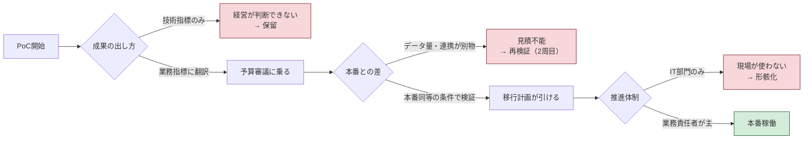

「生成AIのPoCを3件やったが、どれも本番稼働に至らなかった」

この手の話を聞く頻度が、2025年から2026年にかけて明らかに上がった。どれも技術的には成功している。精度は出ていたし、デモでは動いていた。それでも本番に行かない。

理由はだいたい1つに収束する。**PoCの成果が、経営が意思決定できる形になっていない。**

## 数字で見る「導入した／していない」の分布

JUASの[企業IT動向調査2026](https://juas.or.jp/activities/research/it_trend/)を見ると、言語系生成AIを「導入済み」と答えた企業は33.9%、「試験導入中・導入準備中」を含めると53.4%。売上高1兆円以上の大企業に限れば85.1%が導入済みだ。

画像・動画系が34.2%、コード系が32.6%で、どちらも前年度から10ポイント以上伸びている。IT予算増の理由として「AI関連の投資・利用料増加」を挙げた企業は、2025年度計画の36.3%から2026年度予測で43.7%へ。お金は確実に流れている。

ここで気になるのは、53.4%のうち19.5ポイント分が「試験導入中・導入準備中」に滞留している点だ。**この層がいつ「導入済み」に変わるのか**。変わらないまま次の年度も試験導入中だと答えるなら、それがPoC疲れの実体ということになる。

## PoCが止まる3つの型

観測した範囲での分類なので、網羅ではない。ただ、この3つはよく見る。

### 型1：評価軸がエンジニアリング寄り

「精度85%達成」「処理時間が3分の1」。技術的には立派な成果だが、経営会議でこれを出しても判断材料にならない。85%が高いのか低いのか、判断する基準を経営層は持っていない。

必要なのは「この業務の月間工数が120時間から40時間になり、年間で約1,000万円分の人件費が別の仕事に回せる」という形への翻訳だ。翻訳できない数字は、予算がつかない。

### 型2：スコープを絞りすぎて本番と別物になる

リスクを避けようとして対象を絞ると、PoC環境と本番環境の差が開く。データ量が2桁違う、連携先システムが本番にだけある、権限管理がPoCでは省略されていた。結果、スケールアップの見積もりが出せず「もう一度検証しましょう」になる。

これが2周目のPoCを生む。

### 型3：IT部門の単独作業になっている

推進をIT部門だけに任せると、業務部門が当事者にならない。ツールが完成しても「現場が使ってくれない」で終わる。使われないものにROIは出ない。

前の2つと違ってこれは体制の問題なので、KPIをいくら直しても解決しない。



3つの関門を全部通らないと本番に行かない。逆に言えば、止まっているPoCがどの関門で落ちたかは特定できるはずだ。

## KPIを「削減」と「創出」の両方で置く

AI投資の効果をコスト削減だけで測ると、ROIに天井ができる。ある業務の工数がゼロになったら、そこで打ち止めになるからだ。

両軸で置く。

| 軸 | 指標 | 測り方 | 測り始める時期 |
|---|---|---|---|
| 削減 | 対象業務の月間工数 | 導入前に1か月分を実測 | 導入の1か月以上前 |
| 削減 | 差し戻し・手戻り件数 | チケット／インシデント数 | 同上 |
| 創出 | 提案件数・提案までのリードタイム | CRMの案件データ | 同上 |
| 創出 | 顧客への一次回答までの時間 | 問い合わせ管理ツール | 同上 |
| 創出 | 担当者が「別の仕事に使えた時間」 | 月次の自己申告でよい | 導入後から |

最後の1つは精度が低い。それでも入れているのは、削減した工数が何に化けたかを追わないと、「余った時間で雑談していた」のか「新規提案を3件出した」のかが区別できないからだ。ROIの分子が変わる。

**導入前の実測を飛ばさない。** これが一番よくある失敗で、後から取り返せない。半年後に「体感では速くなった」としか言えない案件は、横展開の稟議で必ず止まる。

## ROIの出し方と、感度分析

計算自体は難しくない。

```
Step 1  ベースライン計測
        対象業務の月間工数・エラー率・コスト・売上貢献を導入前に記録

Step 2  投資コストの全量
        ライセンス + 開発 + 運用 + 教育 + 移行中の生産性低下
        ↑ 最後の項目を入れ忘れると、現場との数字が合わなくなる

Step 3  効果の定量化（6ヶ月 / 1年 / 3年）
        直接効果（工数削減額）＋ 間接効果（品質・売上）

Step 4  ROI = (効果額 − 投資額) ÷ 投資額 × 100
        楽観 / 中立 / 悲観 の3シナリオで出す
```

Step 4の3シナリオが実務では効く。単一の数字を出すと「その前提は本当か」という議論で止まるが、3本出すと議論が「どの前提が一番不確実か」に移る。後者のほうが結論に近い。

前提を変えたときROIがどれだけ動くかを示すと、経営層はリスクの所在を掴める。掴めれば判断できる。判断できれば予算が出る。

## 「うまくいっている会社」の定義を借りる

自社だけで基準を作るのが難しいなら、外の評価軸を借りる手がある。

経済産業省・東京証券取引所・IPAが2026年4月10日に[DX銘柄2026](https://www.meti.go.jp/press/2026/04/20260410002/20260410002.html)を発表した。選定は30社、うちDXグランプリが3社（ブリヂストン、ミスミグループ本社、三井住友フィナンシャルグループ）。ほかにDX注目企業17社、DXプラチナ企業2026-2028が2社。

選定企業の事例は[IPAが公開している](https://www.ipa.go.jp/digital/dx/dx-meigara.html)ので、自社と近い業種・規模の事例を読んで、評価項目を自社のKPI設計に流用するのが早い。ゼロから指標を考えるより、既に評価されている枠組みを使ったほうが社内の合意も取りやすい。

ただし注意点がある。DX銘柄は上場企業が対象で、選定企業の規模は自社と全然違う可能性が高い。施策をそのまま真似ると予算が合わない。借りるのは**評価の観点**であって、施策ではない。

## 経営層に出す提案書の形

現場のエンジニアやDX担当が承認を取れない最大の理由は、技術の話をしすぎることだと思う。経営層が知りたいのは3つしかない。

1. どのビジネス課題が解決されるか
2. いくら儲かるか、またはいくらの損失が防げるか
3. 何がリスクで、どう対処するか

5枚で足りる。

**1枚目：サマリー**
現状の痛みを数字で（「月120時間」「年間1,000万円相当」）。施策の概要は技術用語を使わずに。期待ROIは3年分の3シナリオ。決めてほしいことを明記する。

**2〜3枚目：課題と解決策**
なぜこの業務なのか。自社のデータや強みがどう効くのか。

**4枚目：実行計画**
3か月・6か月・1年のフェーズ分けと、各フェーズのGo/No-Go判断基準。判断基準を先に書いておくと、撤退の議論が感情的にならずに済む。

**5枚目：リスクと対策**
技術・組織・コストのリスクを正直に並べ、それぞれに対策を対で置く。

リスクを隠した提案書は、一度バレると次から信用されない。先に開示して対策を示すほうが、結果的に承認率は高いと感じている。

## 今日から3か月でやること

**〜1か月**
- 止まっているPoCが、さっきの3つの関門のどこで落ちたかを1件ずつ判定する
- 自社の「一番痛い業務課題」を3つ、経営層と口頭で合意しておく

**〜3か月**
- 1つに絞り、導入前のベースラインを実測する（これを飛ばさない）
- 業務側の責任者を「ビジネスオーナー」として任命する。IT部門は支援に回る

**〜1年**
- 最初の成功事例を社内に共有し、横展開の材料にする
- 2件目以降は、1件目のKPI設計をテンプレートとして使い回す

## まとめの代わりに

データが示しているのは、生成AIに効果があるかどうかではない。すでに8割以上の企業が何らかの形で使っている。

詰まっているのは経営・組織・KPI設計の側だ。PoCが本番にならないのは、技術が足りないからではなく、実験と経営をつなぐ回路が設計されていないから。

もし今、止まっているPoCが手元にあるなら、最初にやることは再検証ではないと思う。前回の検証で何を測っていたかを見返して、それが経営の判断材料になる形だったかを確かめる。だいたい、そこで理由が分かる。

---

**参照**
- [JUAS 企業IT動向調査2026](https://juas.or.jp/activities/research/it_trend/)
- [経済産業省「DX銘柄2026」「DX注目企業2026」「DXプラチナ企業2026-2028」を選定しました](https://www.meti.go.jp/press/2026/04/20260410002/20260410002.html)（2026年4月10日）
- [IPA DX銘柄](https://www.ipa.go.jp/digital/dx/dx-meigara.html)

PoCの3つの型とKPI表は公開調査ではなく、自分の整理です。
