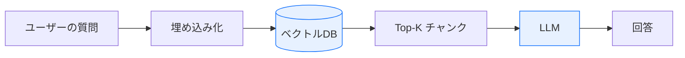
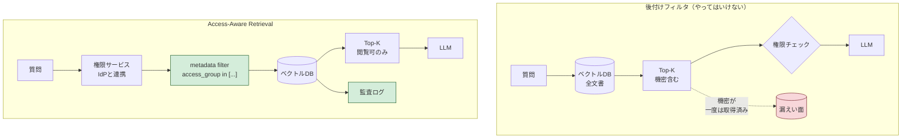
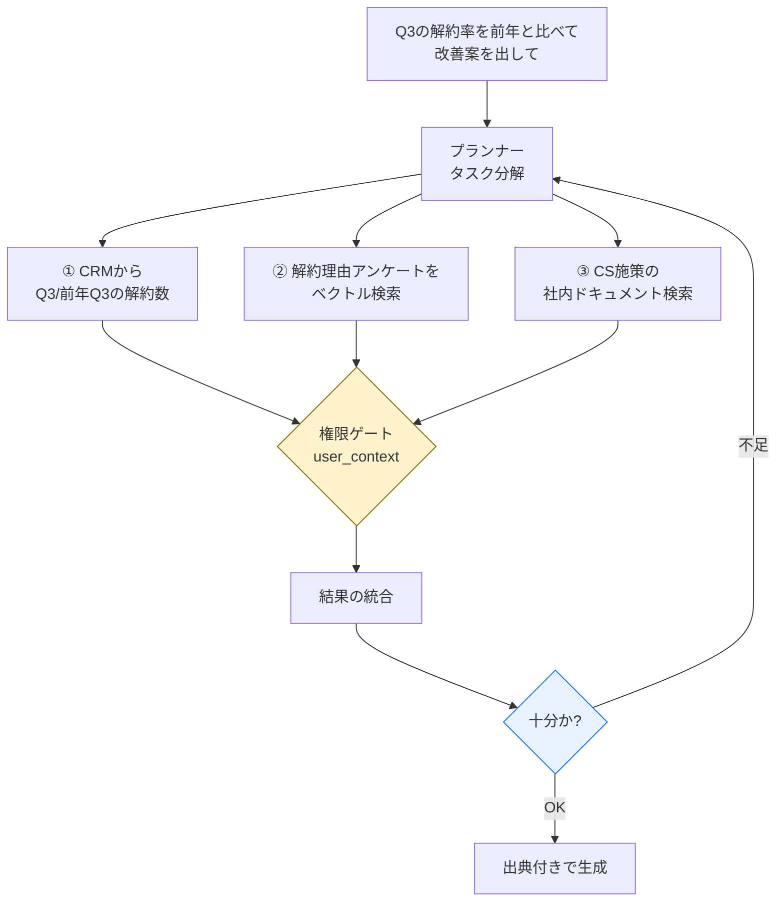

社内文書をLLMに読ませるRAGは、PoCまでなら数日で動く。ベクトルDBを立てて、PDFをチャンクに割って、埋め込みを入れて、Top-Kを引いてプロンプトに詰める。それだけで「おお、社内規程に答えてくれる」というデモになる。

本番に出すとき最初に壊れるのは、たいてい検索精度ではない。権限だ。

人事部のフォルダにあった評価シートが、一般社員の質問に対する回答の根拠として出てくる。ファイルサーバー上ではACLで守られていたのに、埋め込みにした瞬間その情報が消えていた、という話になる。しかもRAGは根拠を親切に引用してくれるので、事故は静かに起きるのではなく、はっきりと目に見える形で起きる。

この記事では、権限をRAGのどこに置くべきかと、そこに乗せるAgentic RAGの構成を書く。

## 素朴なRAGが本番で足りなくなる3点

まず、よく作られる構成を確認しておく。



単一部門・単一の文書セットなら、これで十分に使える。全社に広げようとすると3か所で詰まる。

| 詰まる箇所 | 何が起きるか |
|---|---|
| 権限 | ベクトルDBに入れた時点で元のACLが失われ、誰でも全文書を引ける |
| 単一ステップ | 「先月の解約率を前年と比べて原因を挙げて」のように、検索とDB照会と集計が混ざる依頼に答えられない |
| 根拠の欠落 | 出典が付かない回答は、法務・経理の業務では使えない。確認コストが元の作業を上回る |

3つとも「精度を上げる」では解決しない。設計を変える話になる。

## 権限は検索の後ではなく、検索のクエリに入れる

よくある実装が、Top-Kを取ってからユーザーの権限でフィルタするというもの。これは3つの理由で良くない。

1. 機密チャンクが一瞬でもLLMのコンテキストに入る（外部APIを使っていれば、そこに送信されている）
2. フィルタ後に残るチャンクが少なくなり、回答品質がユーザーごとにばらつく
3. 「誰がどの文書を引いたか」がログに残らないので、監査に答えられない

正しくは、ユーザーのアクセス可能なグループIDをメタデータフィルタとしてクエリに渡し、**そもそも引けないようにする**。



実装としてはこれだけのことだ。

```python
def retrieve_with_access_control(
    query_embedding: list[float],
    user: User,
    top_k: int = 10,
) -> list[Document]:
    # IdP由来のグループを引く。キャッシュする場合もTTLは短めに
    accessible_groups = permission_service.get_groups(user.id)

    results = vector_db.query(
        vector=query_embedding,
        filter={
            "access_group": {"$in": accessible_groups},
            "classification_level": {"$lte": user.clearance_level},
        },
        top_k=top_k,
    )

    audit_logger.log(
        user=user,
        query_hash=hash_query(query_embedding),
        retrieved_doc_ids=[r.id for r in results],
    )
    return results
```

メタデータフィルタ付き検索はPinecone、Weaviate、Qdrantのいずれも対応している。マネージドで済ませたいなら、Azure AI Searchのセキュリティトリミングや、Amazon Kendraのドキュメントレベルアクセス制御がそのまま使える。

厄介なのはコードではなく、その手前だ。**`access_group` に何を入れるかを決めるのが本当の仕事になる**。既存のファイルサーバーやSharePointのACLがそのまま使える状態になっている会社は、自分の見た範囲だとあまりない。共有フォルダの権限が10年分のなりゆきで積み上がっていて、誰も正解を知らない、というのがだいたいの実態だと思う。

なので、RAGを作る前にやることは文書の権限分類になる。技術的には退屈だが、ここを飛ばすと後で全部やり直しになる。

### 同期を忘れない

もう1点、運用で落とし穴になるのが権限変更の反映だ。

- 人が異動した → グループを引き直せば次のクエリから効く（クエリ時に権限を引く設計なら自動）
- 文書の権限が変わった／削除された → **ベクトルDB側のメタデータを更新しないと、古い権限のまま引かれ続ける**

後者は忘れられやすい。元文書の更新・削除イベントをフックして、ベクトルDBのメタデータを同期する仕組みを最初から入れておく。

## Agentic RAG：検索1回で終わらせない

権限の土台ができたら、その上で処理を組み立てる。

「Q3の解約率を前年と比べて、カスタマーサクセス向けに改善案を出して」という依頼は、1回のベクトル検索では終わらない。CRMから数字を引き、解約理由のアンケートを検索し、それを突き合わせて文章にする。この分解と実行をLLM自身にやらせるのがAgentic RAGだ。



素朴なRAGとの違いはプランニングとループだ。結果が足りなければ計画に戻る。

重要なのは図の黄色い部分で、**権限ゲートは各ツール実行の内側に置く**。エージェントが増えるほど、入り口で1回チェックする設計は破綻する。ツールが自分でユーザーコンテキストを受け取って、自分で絞る。

```python
class AgenticRAG:
    def __init__(self):
        self.tools = [
            DocumentSearchTool(),      # 各ツールが user_context を受け取り
            DatabaseQueryTool(),       # 自分でフィルタする
            SummaryTool(),
        ]

    def run(self, query: str, user_context: UserContext) -> Response:
        plan = self.planner.create_plan(query, user_context)
        results = []
        for step in plan.steps:
            results.append(
                step.tool.execute(
                    input=step.input,
                    user_context=user_context,  # ツール内で権限を効かせる
                )
            )
        return self.synthesizer.generate(results, cite_sources=True)
```

ここで正直に書いておくと、Agentic RAGは素朴なRAGよりだいぶ高くつく。1回の依頼でLLMを5回も10回も呼ぶので、コストとレイテンシが跳ねる。FAQに答えるだけなら素朴なRAGのままでいい。複数のシステムをまたぐ依頼にだけ使う、という線引きが要る。

Gartnerは2025年6月に、[エージェンティックAIプロジェクトの40%以上が2027年末までに中止される](https://www.gartner.com/en/newsroom/press-releases/2025-06-25-gartner-predicts-over-40-percent-of-agentic-ai-projects-will-be-canceled-by-end-of-2027)と予測している。理由として挙がっているのが、コストの膨張・ビジネス価値の不明確さ・リスク統制の不足の3つ。3つ目は今書いた権限の話そのものだ。

## 根拠を出さない回答は使えない

法務・経理・規制対応でRAGを使うなら、出典の提示は機能ではなく前提になる。3層で組むのが扱いやすい。

**Layer 1: 与えた文書だけで答えさせる**
プロンプトで「提供された文書のみを根拠とし、記載がなければ『該当する記述が見つかりません』と答えよ」と制約する。これだけで、もっともらしい作文はかなり減る。

**Layer 2: 出典を回答文に埋める**
各記述に文書ID・ページ・該当箇所を付け、1クリックで原文が開くようにする。確認が面倒だと誰も確認しなくなるので、UIの手数がそのまま信頼性になる。

**Layer 3: 類似度が低いときは黙る**
検索チャンクとクエリの類似度が閾値を下回ったら、無理に答えず「情報が不足しています」と返す。閾値は0.75あたりから始めて、自社の文書で調整する。この値に一般解はないと思う。

## モデルは1つに寄せない

エンタープライズAPIの支出シェアについて、Menlo Venturesの調査では2026年時点でAnthropicが約40%、OpenAIが27%、Googleが21%となっている（[Menlo Ventures / LLM market update](https://menlovc.com/perspective/2025-mid-year-llm-market-update/)）。数年前はOpenAIが50%で首位だったので、入れ替わりが起きた形だ。

一方でGartnerは、[2027年までに組織はタスク特化の小型モデルを汎用LLMの3倍使うようになる](https://www.gartner.com/en/newsroom/press-releases/2025-04-09-gartner-predicts-by-2027-organizations-will-use-small-task-specific-ai-models-three-times-more-than-general-purpose-large-language-models)と予測している。回数ベースの話であって、支出ベースではない点には注意がいる。

要するに、用途で使い分けるということだ。

| 用途 | モデル規模 | 理由 |
|---|---|---|
| 契約書の解釈、複数文書をまたぐ推論 | フロンティアモデル | 長文脈と指示追従が効く。単価は高い |
| FAQ応答、定型文書の要約 | 小型モデル（Phi-4、Gemma 3等） | 回数が多い処理はここに逃がす |
| 分類、ルーティング、タグ付け | 小型モデルのファインチューニング | 十分な精度が出て、桁で安い |
| オフライン・現場端末 | 量子化した小型モデル | ネットワークに依存しない |

具体的なモデル名は半年で古くなるので、自分で書くなら「規模帯で決めて、名前は設定ファイルに逃がす」を勧める。実際、この記事を最初に書いたときに挙げたモデル名は、もう推奨できない世代になっていた。

## 本番に出す前のチェックリスト

**権限**
- [ ] IdPと連携してクエリ時に権限を引いているか（起動時キャッシュのみになっていないか）
- [ ] 文書に分類レベル（Public/Internal/Confidential/Secret）のメタデータが付いているか
- [ ] 元文書の権限変更・削除がベクトルDBのメタデータに同期されるか
- [ ] 全クエリと取得ドキュメントIDが監査ログに残るか

**品質**
- [ ] 全回答に出典（文書名・該当箇所）が付くか
- [ ] 類似度が閾値を下回ったとき、答えずに済む経路があるか
- [ ] 回答品質の定期評価セット（自社の実際の質問30〜50件）があるか

**運用**
- [ ] ユースケース別のモデル使い分けが設定で切り替わるか
- [ ] トークン消費が用途別に見えるか
- [ ] LLM側の障害時のフォールバックが決まっているか

## まとめの代わりに

社内RAGの難所は、ベクトル検索のチューニングではなく、文書に「誰が見ていいか」を付ける作業だと思っている。地味だし、AIの案件として承認を取りにくい部分でもある。

なので、着手するならこの順番を勧める。

1. 対象範囲の文書に権限メタデータを付ける（ここが一番長い）
2. メタデータフィルタ付きの素朴なRAGを1部門で本番稼働させる
3. 複数システムをまたぐ依頼が出てきたら、そこだけAgentic RAGにする

逆から入ると、動くデモは早くできて、本番では出せない、という結末になりやすい。

---

**参照**
- [Gartner: Over 40% of Agentic AI Projects Will Be Canceled by End of 2027](https://www.gartner.com/en/newsroom/press-releases/2025-06-25-gartner-predicts-over-40-percent-of-agentic-ai-projects-will-be-canceled-by-end-of-2027)
- [Gartner: Small, Task-Specific AI Models 3x More Than General-Purpose LLMs by 2027](https://www.gartner.com/en/newsroom/press-releases/2025-04-09-gartner-predicts-by-2027-organizations-will-use-small-task-specific-ai-models-three-times-more-than-general-purpose-large-language-models)
- [Menlo Ventures: LLM Market Update](https://menlovc.com/perspective/2025-mid-year-llm-market-update/)
