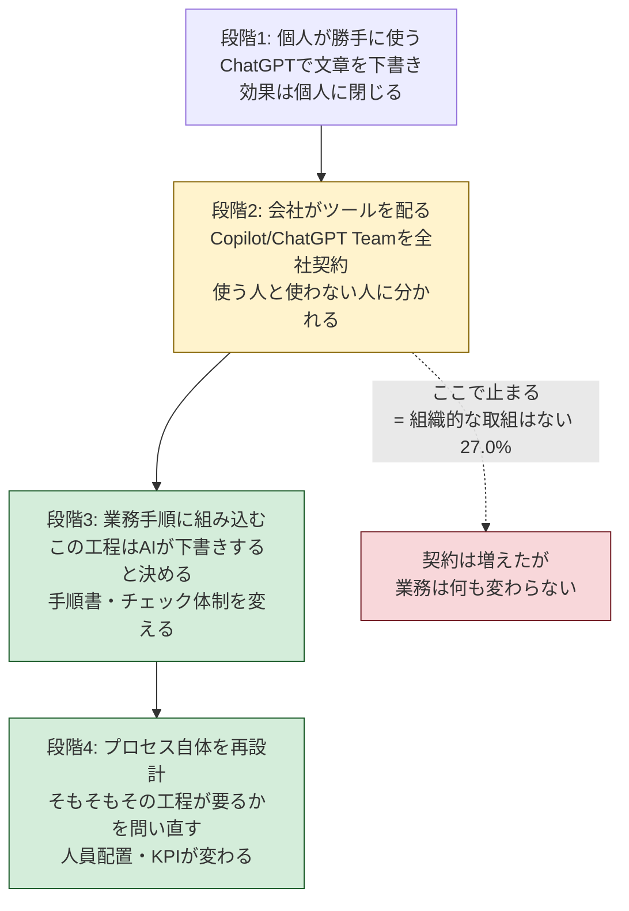

総務省が2026年7月24日に公表した[令和8年版 情報通信白書](https://www.soumu.go.jp/johotsusintokei/whitepaper/)に、並べて読むと妙な組み合わせの数字が載っている。

- 企業が生成AIを1つ以上の業務で使っている割合：**86.4%**（2024年度は55.2%）
- 業務変革について「組織的な取組はない」と答えた割合：**27.0%**

8割以上が使っていて、4社に1社は組織として何もしていない。この2つは矛盾していない。むしろ今の日本のAI活用を、これ以上ないくらい正確に言い表していると思う。

つまり、使っているのは社員個人であって、会社ではない。

## 白書の数字を整理する

調査は2026年1〜2月、日本・米国・ドイツ・中国の4か国で実施されたもの。主な数字はこうなっている。

| 指標 | 日本 | 米国 | ドイツ | 中国 |
|---|---|---|---|---|
| 個人の生成AI利用経験率 | 58.8% | 75.6% | 75.6% | 93.6% |
| 「組織的な取組はない」 | 27.0% | 1.4% | 4.9% | 2.6% |

個人の利用経験率58.8%は、2024年度調査の26.7%から2年で倍以上。利用経験者のうち約3割がほぼ毎日使っている。伸び自体は素直に速い。

問題は下の行だ。組織的な取組がないと答えた企業が、米国1.4%・ドイツ4.9%・中国2.6%に対して日本だけ27.0%。ひと桁違う。個人利用率の差（58.8% vs 75.6%）が1.3倍程度なのに対して、こちらは約20倍の開きがある。

日本が遅れているのは「AIを使うこと」ではない。**AIを前提に仕事のやり方を変えること**のほうだ。

## 「導入率」を追いかけても何も分からない

同じ傾向は別の調査にも出ている。JUAS（日本情報システム・ユーザー協会）の[企業IT動向調査2026](https://juas.or.jp/activities/research/it_trend/)では、言語系生成AIを「導入済み」と答えた企業が33.9%、「試験導入中・導入準備中」を含めると53.4%。売上高1兆円以上の大企業に限れば85.1%が導入済みだった。

白書の86.4%とJUASの33.9%。数字が3倍近く違うのは、聞いていることが違うからだ。白書は「1つ以上の業務で使っているか」、JUASは「会社として導入したか」。前者は社員がChatGPTを開けばYesになる。

この差そのものが、さっきの27%の正体だと見ていい。

ついでに言うと、導入率という指標はもう役に立たない。全員が「導入済み」と答える世界では、導入したかどうかで差はつかない。見るべきなのは、AIを入れた結果どの業務プロセスが消えたか、あるいは変わったかだ。

## 個人利用から組織利用への断絶はどこにあるか

個人が使い始めてから、会社の業務が変わるまでには段階がある。白書の数字で言えば、日本企業の多くは2段目で止まっている。

段階2と段階3の間に断絶がある。理由は単純で、ここから先は情シスやDX推進室だけでは決められないからだ。

段階2まではIT部門の仕事で済む。ツールを選び、契約し、アカウントを配る。予算も通しやすい。ところが段階3は「この業務のやり方を変える」という話なので、その業務を持っている部門長の承認がいる。現場は自分の手順を変えたくない。誰も損をしないので、段階2で自然に止まる。

27%という数字は、たぶんこの構造の結果だ。

## 段階3に進むために決めること

ここからは白書の外の話になる。自分の考えなので、そのつもりで読んでほしい。

段階3に進む会社と進まない会社の違いは、意欲でも予算でもなく、**「誰がこの業務の変更を決めるのか」が決まっているかどうか**だと思っている。

具体的には3つ。

**1. 対象業務を1つに絞り、その業務の責任者を巻き込む**

全社展開から始めると、必ず段階2で止まる。まず1部門・1業務に絞る。そのうえで、推進役をIT部門ではなく**その業務の責任者**にする。IT部門は支援に回る。ここを逆にすると「ツールは来たが使われない」に着地する。

**2. 変更前の数字を測っておく**

AIを入れる前に、その業務の月間工数・処理件数・差し戻し率を記録する。これをやっていないと、半年後に「なんとなく楽になった気がする」以上のことが言えなくなり、横展開の稟議が通らない。地味だが、ここを飛ばした案件が後でいちばん困る。

**3. 「入れてはいけない情報」のリストを先に作る**

ガイドラインを一から書こうとすると数か月かかる。まずは禁止情報のリストだけでいい。顧客の個人情報、未公開の財務数値、契約書の原本——このあたりを1ページにまとめて配るだけで、現場は動ける。

### 最初の90日でやること

| 期間 | やること | 終わったと言える状態 |
|---|---|---|
| 〜2週目 | 対象業務を1つ決める／業務責任者を指名する | 部門長が「自分の担当」と認識している |
| 〜4週目 | 変更前のベースライン計測／禁止情報リストの配布 | 月間工数と差し戻し率が数字で出ている |
| 〜8週目 | 手順書にAIを使う工程を明記する | 「AIが下書き→人が確認」が手順書に載っている |
| 〜12週目 | 変更後の数字を取り、差分を出す | 経営会議に出せる1枚ができている |

12週目の1枚が、次の部門を口説く材料になる。逆に言えば、ここまで到達していない取り組みは横展開できない。

## 国産LLMという選択肢は現実的になった

「機密情報を扱うのでクラウドのAIは使えない」という制約がある業務については、2025年から2026年にかけて選択肢が実際に増えた。

**NTTの[tsuzumi 2](https://group.ntt/jp/newsrelease/2025/10/20/251020a.html)** は2025年10月に提供開始。パラメータ数を7Bから30Bに拡大しながら、GPUカード1枚で動作する設計を維持している。GPT-3.5に対する日本語タスクのウィンレートは81.3%。2026年5月には[図表入りの日本語ビジネス文書処理を強化したアップデート](https://group.ntt/jp/newsrelease/2026/05/19/260519a.html)が出ている。

**NECのcotomi** は約13Bパラメータで、エージェント技術「cotomi Act」がWebArenaで80.4%を記録。2026年3月にデジタル庁のGovernment AI基盤に採択された。GPU2枚で動く。

正直に書くと、汎用的な文書作成やアイデア出しの品質では、海外のフロンティアモデルのほうがまだ上だと思う。国産LLMが効くのは「オンプレで動かす必要がある」「日本語の業務文書に特化している」という制約が先にある場合だ。制約がないのに国産を選ぶ理由は、今のところ薄い。

## 58.8%でも86.4%でもなく、27%を見る

利用率の数字は今後も上がる。2年で26.7%→58.8%まで来たものが、来年も伸びること自体には驚きがない。

差がつくのは「組織的な取組はない」の27%のほうだ。ここに入っている企業は、社員が個人の工夫でAIを使い、その成果は個人に閉じたまま、会社の業務プロセスは3年前と同じ形で残っている。競合が段階3に進んだとき、この差は工数と単価の両方に効いてくる。

今日できることを1つ挙げるなら、自社が段階1〜4のどこにいるかを1分で決めることだと思う。段階2なら、次に変える業務を1つ選ぶ。それだけで27%の外側に出る準備ができる。

---

**参照した一次資料**

- [総務省 令和8年版 情報通信白書](https://www.soumu.go.jp/johotsusintokei/whitepaper/)（2026年7月24日公表、調査は2026年1〜2月実施）
- [JUAS 企業IT動向調査2026](https://juas.or.jp/activities/research/it_trend/)
- [NTT版LLM tsuzumi 2 提供開始](https://group.ntt/jp/newsrelease/2025/10/20/251020a.html) / [2026年5月アップデート](https://group.ntt/jp/newsrelease/2026/05/19/260519a.html)

段階分けと90日計画の部分は公開データではなく、自分の整理です。数字の解釈が違うと思った方は指摘してもらえると助かります。
