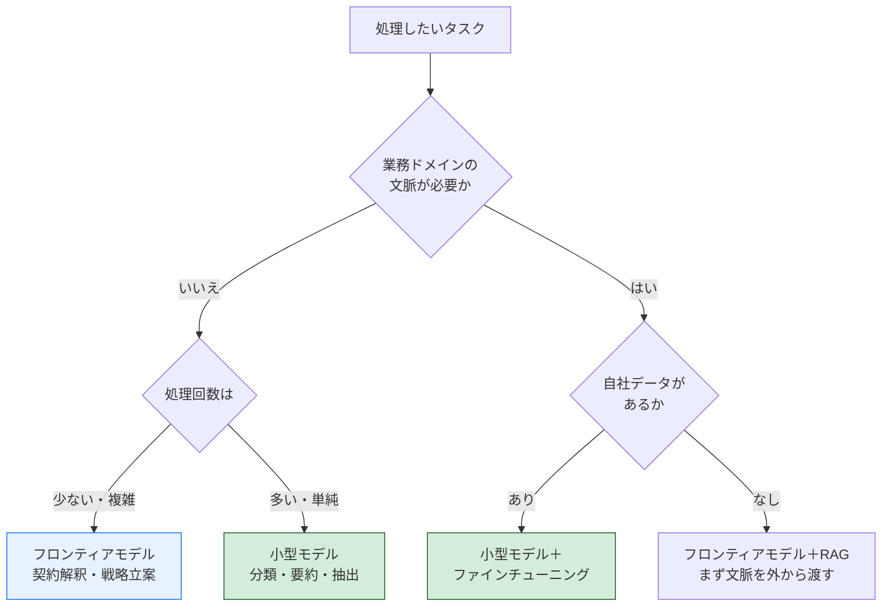
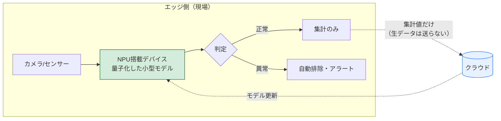

Gartnerが2025年10月20日に発表した[Top Strategic Technology Trends for 2026](https://www.gartner.com/en/newsroom/press-releases/2025-10-20-gartner-identifies-the-top-strategic-technology-trends-for-2026)は、10項目のうち大半がAI関連で占められている。

- AI-native development platforms
- AI supercomputing platforms
- Confidential computing
- Multiagent systems
- **Domain-specific language models**
- **Physical AI**
- Preemptive cyber security
- Digital provenance
- AI security platforms
- Geopatriation

この10項目は The Architect（基盤をつくる）/ The Synthesist（価値を組み立てる）/ The Sentinel（信頼を守る）の3テーマに分類されている。Physical AI は Synthesist に入る。

この中から、実際に手を付ける順番を考えたい。結論から書くと、**多くの日本企業が最初に触るべきは Domain-specific language models、つまりドメイン特化の小型モデルだ**と思っている。理由は最後に書く。

## Physical AI：面白いが、入り口としては重い

Physical AI は、AIが物理空間のロボットや機械を制御し、環境を認識して判断・行動する技術群を指す。ロボット、ドローン、スマート機器が対象になる。従来の産業用ロボットが決められた動作を繰り返すのに対して、センサーフュージョンと学習モデルを組み合わせて、想定外の状況にも対応する。

日本にとって意味があるのは、これが人手不足に直接効く技術だからだ。製造・物流・医療の現場で人が足りないという問題は、しばらく構造的に続く。

ただし、入り口としては重い。

**安全規格への対応が先に来る。** 産業用ロボットならISO 10218、人と同じ空間で動く協働ロボットならISO/TS 15066への準拠が要る。これは後から足せる性質のものではなく、設計段階から織り込む必要がある。初期見積もりに安全設計の費用を入れていない案件は、ほぼ確実に予算を超える。

**投資回収が年単位になる。** ハードウェアを買い、ラインを止めて設置し、現場のオペレーションを変える。数か月で判断できる類の投資ではない。

なので、Physical AI は「検討を始めるべき」トレンドではあるが、「今期から着手する」トレンドとしては条件を選ぶ。すでにロボットが入っているラインがあって、その置き換えや高度化として考えるなら現実的だと思う。

## Domain-specific language models：ここが一番早く効く

Gartnerは別途、[2027年までに組織はタスク特化の小型AIモデルを汎用LLMの3倍使うようになる](https://www.gartner.com/en/newsroom/press-releases/2025-04-09-gartner-predicts-by-2027-organizations-will-use-small-task-specific-ai-models-three-times-more-than-general-purpose-large-language-models)と予測している。**使用回数ベース**の話で、支出ベースではない点は押さえておきたい。

理由として挙がっているのは2つ。汎用LLMは業務ドメインの文脈が要る処理で精度が落ちること。そして小型モデルのほうが応答が速く、計算資源が少なく済むこと。

代表的な小型モデルには MicrosoftのPhi-4（14B）、GoogleのGemma 3（1B/4B/12B/27B）、MetaのLlama 3.2（1B/3B）あたりがある。サイズが小さいからといって、自社の業務に限れば精度が足りないとは限らない。

### どこに使い分けの線を引くか



実務で効くのは図の左下と右下、つまり小型モデル側だ。問い合わせの分類、請求書からのデータ抽出、ログの要約、タグ付け。どれも回数が多くて、1回あたりの判断は単純。ここをフロンティアモデルで処理していると、精度は過剰でコストだけ膨らむ。

ファインチューニング自体は、ライブラリの整備が進んだので昔ほど大仕事ではない。

```python
from trl import SFTTrainer
from transformers import AutoModelForCausalLM, AutoTokenizer

model_id = "microsoft/phi-4"
model = AutoModelForCausalLM.from_pretrained(model_id)
tokenizer = AutoTokenizer.from_pretrained(model_id)

trainer = SFTTrainer(
    model=model,
    train_dataset=domain_dataset,   # 自社の業務データ
    dataset_text_field="text",
    max_seq_length=2048,
)
trainer.train()
```

難所はコードではなくデータのほうだ。「入力と、理想的な出力」のペアを数百〜数千件そろえる必要がある。過去の業務ログから作れるなら早いが、フォーマットがバラバラだと整形だけで数週間かかる。ここを甘く見積もらないほうがいい。

正直に書くと、ファインチューニングに入る前に、まずプロンプトとRAGでどこまで行けるかを試すべきだと思っている。それで十分な精度が出るケースは多いし、出ない場合も「何が足りないのか」がデータ設計のヒントになる。

## Physical AI と小型モデルをつなぐのがエッジAI

Gartnerの10項目には「エッジAI」という単独の項目はないが、Physical AI を実際に動かす層としてここに触れておく。

デバイス上で推論を完結させる構成が選ばれる理由は3つ。

**レイテンシ** — 製造ラインの異常検知や自律移動体の判断は、ネットワーク往復を待てない。エッジで推論すればミリ秒台に収まる。

**プライバシー** — 医療画像、顔認証、生体データをクラウドに送らずに処理できる。個人情報保護法やGDPRへの対応が、設計の段階で楽になる。

**通信コスト** — カメラ映像を常時クラウドに送る構成は、台数が増えた瞬間に回線費で破綻する。



ポイントは点線の部分で、**生データを送らず集計値だけを上げる**。これでプライバシーと通信コストの両方が片付く。モデルの更新はクラウドから配る。

ハードウェアの選択肢も増えた。スマートフォン向けSoCへのNPU搭載は標準化し、産業用途ではNVIDIA Jetsonシリーズや、NPU内蔵のx86プロセッサが組み込み用途で使われている。

市場規模については、調査会社によって数字がかなり違う。2026年のエッジAI市場を Grand View Research は約300億ドル、Fortune Business Insights は約470億ドルと見ている。1.5倍以上の開きがあるのは、どこまでを「エッジAI」に含めるかの定義が各社で違うからだ。この手の市場予測を稟議に貼るときは、1社の数字だけを根拠にしないほうがいい。

## 3つの比較と、優先順位

| 技術 | 着手のしやすさ | ネックになるもの | 回収期間の目安 |
|---|---|---|---|
| Physical AI | 低 | 安全規格対応、ハードウェア調達、現場オペレーションの変更 | 年単位 |
| 小型モデル（クラウド） | 高 | 学習データの整備 | 数か月 |
| 小型モデル（オンプレ） | 中 | GPU調達、運用体制 | 1年前後 |
| エッジAI | 中 | デバイス選定、現場への設置、モデル更新の運用 | 1〜3年 |

回収期間は業種と規模で大きく振れるので、目安として読んでほしい。

優先順位の考え方としてはこうなる。

- **今期から成果を出したい** → クラウドの小型モデル。既存APIで始められて、失敗しても損失が小さい
- **コストを下げたい／データを外に出せない** → 小型モデルのオンプレ化、またはエッジAI
- **人手不足が事業のボトルネックになっている** → Physical AI の検討を始める。ただし着手は来期以降の想定で

## なぜ小型モデルを最初に勧めるのか

冒頭の結論の理由を書く。

小型モデルへの取り組みは、**失敗したときの損失が一番小さくて、学べることが一番多い**からだ。

クラウドAPIで小型モデルを試すのに必要なのは、数万円と数週間。うまくいかなくても、失うのはそれだけで済む。一方で、この過程で必ず「自社の業務データがどういう形で残っているか」に向き合うことになる。ログがバラバラ、過去の判断根拠が残っていない、フォーマットが部署ごとに違う——だいたい何か出てくる。

そして、そのデータ整備こそが Physical AI にもエッジAIにも効く。どのトレンドに進むにしても、自社データが使える形になっていないと先に進めない。

順番としては、小型モデルで小さく失敗してデータの現状を把握し、それから重い投資を判断する。逆から入ると、数千万円を投じたあとでデータが使えないことに気づく。

## 次にやること

1. 自社の業務から「回数が多くて、判断が単純な処理」を3つ挙げる
2. そのうち1つを、クラウドの小型モデルAPIで試す（まずプロンプトだけ。ファインチューニングはその後）
3. 試す過程で、その業務のデータがどこに、どんな形で残っているかを記録する
4. 3の結果を見て、オンプレ化・エッジ・Physical AI に進むかを判断する

Gartnerの10項目は、どれか1つを選ぶリストではなく、依存関係のあるリストだと思っている。基盤が要るものは基盤から。

---

**参照**
- [Gartner Identifies the Top Strategic Technology Trends for 2026](https://www.gartner.com/en/newsroom/press-releases/2025-10-20-gartner-identifies-the-top-strategic-technology-trends-for-2026)（2025年10月20日）
- [Gartner: Small, Task-Specific AI Models 3x More Than General-Purpose LLMs by 2027](https://www.gartner.com/en/newsroom/press-releases/2025-04-09-gartner-predicts-by-2027-organizations-will-use-small-task-specific-ai-models-three-times-more-than-general-purpose-large-language-models)
- エッジAI市場規模：[Grand View Research](https://www.grandviewresearch.com/industry-analysis/edge-ai-market-report) / [Fortune Business Insights](https://www.fortunebusinessinsights.com/edge-ai-market-107023)（数字は各社で定義が異なる）

優先順位と比較表は公開資料ではなく、自分の判断です。業種によって順番は変わると思います。
